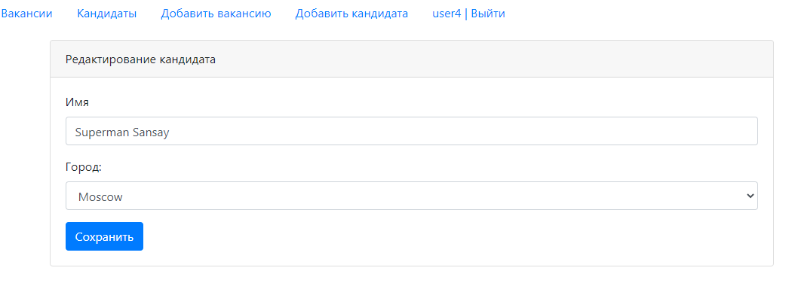

Проект "Работа мечты"
=====================

Проект для изучения Java EE.

Данное приложение - биржа работы.
В системе будут два типа пользователей: кандидаты и рекрутеры. Кандидаты будут публиковать резюме. Рекрутеры будут публиковать вакансии о работе.
Кандидаты могут откликнуться на вакансию. Менеджер может пригласить на вакансию кандидата.

Регистрация пользователя

Авторизация пользователя

Список вакансий

Редактирование вакансии

Список кандидатов

Редактирование кандидата

Загрузка аватара

Добавление нового кандидата

Добавление новой вакансии
